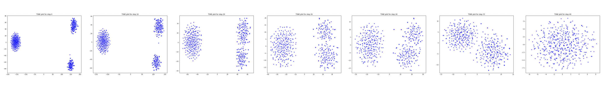
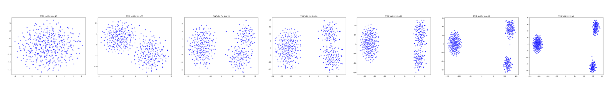
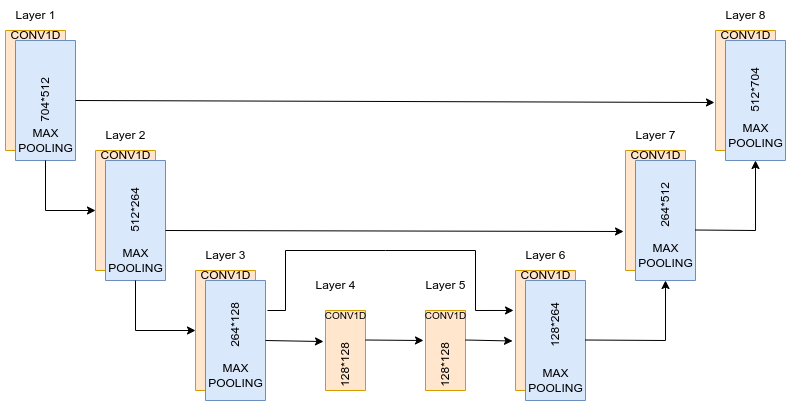

## Speaker Embedding Generation using Denoising Diffusion Probalistic Models

### Denoising Diffusion Probalistic Models




Experiments run on 3.3Ghz AMD EPYC 7002 series. Requires Python 3.8, and these dependencies for CPU instances, please install 'requirements.txt'

```bash
pip3 install -r requirements.txt
```

## Dataset

There are 3 types of embeddings generated from LibreSpeech Corpus: 
1. 64 Dimensional, which has 19k samples
2. 128 Dimensional, which has 49k samples
3. 704 Dimensional, which has 5k samples

## Training
```bash
python3 main.py
```

## Model

Linear and UNet Model are written in model.py file, which can be modified as per the requirement

UNet model Architecture

## Output Audio Samples
These audio samples are generated after passing the generated embeddings to a TTS Engine. 


Female Voice:  
https://github.com/sakshishukla1996/EmbeddingGeneration/blob/master/output/download1Female.wav

Male Voice: 
https://github.com/sakshishukla1996/EmbeddingGeneration/blob/master/output/download3Male.wav

## Output
Red points represents original data points in the distribution and blue ones are generated datapoints. 
T-Sne plot of Generated and Original datapoints. 


## References


